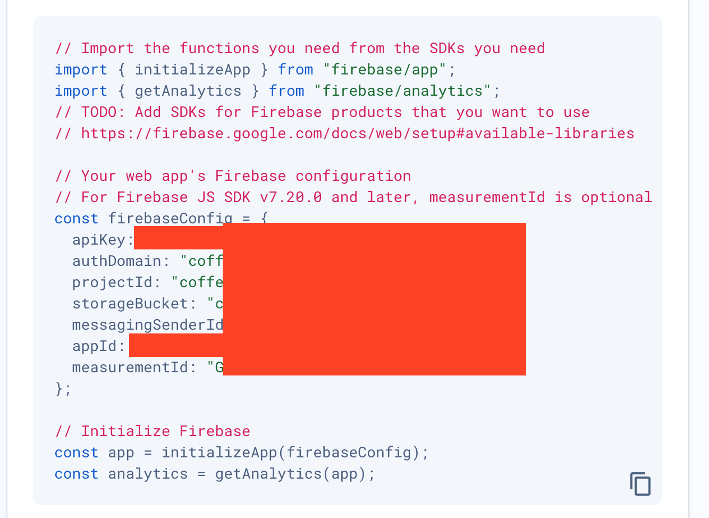

# Backend API for the makeitMVP ecosystem - By MergeIntegration

## 0. Getting Started

1. Clone Repo
2. Run `npm install`
3. Create a `.env` file at the root of the project with the following variables: (apiKey, authDomain, projectId, storageBucket, messagingSenderId, appId, measurementId).
4. You can get the values of these by going to the **Firebase Console -> Select Coffee Chat -> Project Settings**
5. Scroll down to the firebaseConfig code snipet. Should look like this. 
6. Install VS Code [Prettier Extension](https://marketplace.visualstudio.com/items?itemName=esbenp.prettier-vscode)
7. Install VS Code [Eslint Extension](https://marketplace.visualstudio.com/items?itemName=dbaeumer.vscode-eslint)
8. From the root folder run `ts-node src/fireStoreTutorial/createDocument.ts` _Should print 'successfully created' to the console._
9. From the root folder run `ts-node src/fireStoreTutorial/readDocument.ts` _Should Print the newly created document to the console._
10. Run `ts-node src/fireStoreTutorial/updateDocument.ts` followed by `ts-node src/fireStoreTutorial/updateDocument.ts` _should print the object with applied updates._
11. Running `ts-node src/fireStoreTutorial/deleteDocument.ts` _should print 'successfully Deleted'_

These are simple CRUD operations using the Firebase Node package. You can experiment with the files in the folder firestoreTutorial to get more familiar with the toolkit.

## 1. Naming Conventions:

- Use camelCase for variable and function names.
- Use PascalCase for class names and interface names.
- Use camelCase for interface members.
- Use PascalCase for type names and enum names.
- Name files with camelCase (for example, `myFile.tsx` or `views.tsx`)

## 2. Lint Rules and Code Formatting:

ESLint statically analyzes the code to quickly find issues. Prettier is a code formatter that dynamically updates code to adhere to certain formatting rules.

Resources: [What is a Linter ?](https://www.testim.io/blog/what-is-a-linter-heres-a-definition-and-quick-start-guide/), [ESlint](https://typescript-eslint.io/), [Prettier](https://prettier.io/docs/en/)

## 3. Git Workflow and Conventions

The project enforces the [Conventional Commits](https://www.conventionalcommits.org/) specification. This means that all your commit messages must be formatted according to the specification. To help you write commit messages, the project uses [Commitizen](https://github.com/commitizen/cz-cli), an interactive CLI that guides you through the commit process.

To commit new changes simply run `npm run commit` instead of `git commit -m`. This will open an interactive CLI.

The Collaborative Workflows we'll be following can be summarized in these two guides:

- [GitFlow Workflow](https://www.atlassian.com/git/tutorials/comparing-workflows/gitflow-workflow)
- [Feature Branch Workflow](https://www.atlassian.com/git/tutorials/comparing-workflows/feature-branch-workflow)

### Step by step workflow for working on a new feature or bug fix:

1. Run `git checkout develop`
2. Fetch the latest changes from the remote by running `git pull`
3. Checkout a new branch with the following naming format **dev-<user>-<feature>** _(e.g. `git checkout -b dev-christian-oauth`)_
4. Make updates and new additions in the previously created branch
5. When the feature or bug-fix is complete, run `git checkout develop`
6. Run `git pull` again fetch any updates from the dev branch
7. Checkout your local working branch `git checkout -b dev-christian-oauth`
8. Run `git merge develop` to locally merge your branch with the updated dev branch
9. If there are no conflicts, simply run `git push --set-upstream origin dev-christian-oauth` and go to [github](https://github.com/makeitMVPadmin/Communiti-Platform/pulls), create a new Pull request. Important note: **Set base branch to Dev**.

_If you ran into conflicts, there are several ways to resolve this._

## 4. Tech Stack

Our API will be completely Serverless harnessing the power of [Firestore](https://firebase.google.com/docs/firestore), [Cloud Functions](https://firebase.google.com/docs/functions), [API Getaway](https://cloud.google.com/api-gateway), and Typescript.

Here's a **[Short Guide](https://docs.aws.amazon.com/prescriptive-guidance/latest/best-practices-cdk-typescript-iac/typescript-best-practices.html#naming-conventions)** about the best practices for working with Typescript.

If you check out the Firestore [REST API specification](https://firebase.google.com/docs/firestore/reference/rest/#rest-resource:-v1.projects.databases.documents) and compare it to the structure of the [endpoints for cloud functions](https://cloud.google.com/functions/docs/calling/http#url). You will notice two divergent patterns, the former follows a resource naming structure, and the latter has urls that are action oriented. So in order to create a fully serverless API solution that adheres to RESTful principles and provides a consistent, easy to use interface for the frontend teams, we can use API getaway, this would allow us to create a unified interface that can route requests to either Firestore or Cloud Functions.
